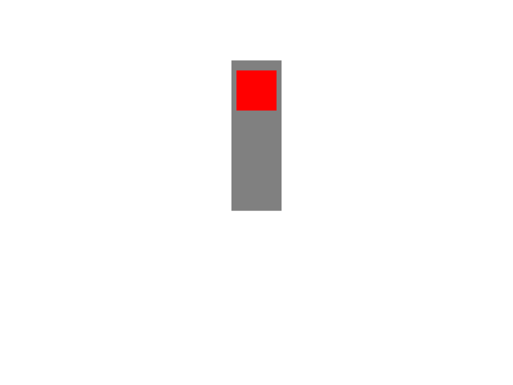

<p align="center">

</p>

# Nelsie

[](https://github.com/spirali/nelsie/actions/workflows/build.yaml)

Nelsie allows you to create slides programmatically using Python. It is a library
with a Python API and a renderer written in Rust.
The output is a PDF file or a set of SVG/PNG files.

There is no DSL or GUI; presentations created with Nelsie are fully programmed in Python.
We believe that creating presentations in a programmable way
makes the process of creating slides smoother and more reliable.

Nelsie focuses on controlling what the audience sees, so you can continuously reveal fragments of the slide,
or simply manage which parts are highlighted.


**Quick links**

- [Documentation](https://spirali.github.io/nelsie/)
- Demonstration of features ([PDF](https://spirali.github.io/nelsie/pdf/bigdemo.pdf), [source code](examples/bigdemo/bigdemo.py))


## Installation

```commandline
$ pip install nelsie
```


## Hello world

```python
from nelsie import SlideDeck

deck = SlideDeck()

@deck.slide()
def hello_world(slide):
    slide.text("Hello world!")

deck.render("slides.pdf")
```

## Steps revealing

Nelsie allows you to easily reveal parts of slides:

```python
@deck.slide()
def steps_demo(slide):
    semaphore = slide.box(width=100, height=300, bg_color="gray")
    semaphore.box(
        y=InSteps([20, 110, 210]),  # Set "y" coordinate for each step
        width=80,
        height=80,
        bg_color=InSteps(["red", "orange", "green"]),  # Set color for each step
    )

    slide.code(
        """
fn main() {
    // Print text to the console.
    println!()"Hello World!");
}
""",
        "Rust",
        show=4,  # Show in 4. step
        m_top=80,
    )
```

The code generates four  PDF pages:

<p float="left">
  <kbd></kbd>
  <kbd></kbd>
  <kbd></kbd>
  <kbd></kbd>
</p>
