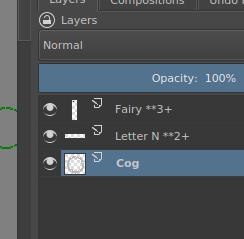

# Images

Images are put into the slides by calling `.image()` on a box. It creates a new box with an image.
Nelsie supports the following formats: SVG, PNG, JPEG, and OpenRaster.

```nelsie
@deck.slide()
def image_demo(slide):
    slide.image("./imgs/nelsie-logo.jpg")
```

!!! note "Note for Elsie users"

    Calling `.image()` creates a new box; this is a different behavior than in Elsie, where calling `.image()` does not create a new box.


## Image box

The `.image()` method also takes the same arguments as `.box()`, which are passed to the underlying box of the image.
The main purpose is to set the image size.
If only width or only height is set, the other coordinate is automatically calculated to maintain the aspect ratio of the image.

```nelsie
@deck.slide()
def image_demo(slide):
    slide.image("./imgs/nelsie-logo.jpg", width="50%")
```

If both width and height are specified, image will try to fill the box while maintaining the aspect ratio;
so part of the box may not be covered by the image.

```nelsie
@deck.slide()
def image_demo(slide):
    slide.image("./imgs/nelsie-logo.jpg", width="50%", height="300", bg_color="green")
```


## Image directory

A directory where images are searched for can be configured via `image_directory`.

```python
# Set image directory globally
deck = SlideDeck(image_directory="path/to/images")

# Set image directory per slide
@deck.slide(image_directory="path/to/images")
def my_slide(slide):
    ...
```

## Image and steps

Formats that supports layers (SVG and OpenRaster) may control revealing a part of image
in steps by naming layers. JPEG, and PNG image does not have any impact on steps.

If a layer has a name that ends with `**EXPR` where `EXPR` is an expression allowed in box's `show` argument, except for last/next/last+/next+ keywords. Keywords are not allowed in an image step definitions.
Example: A layer with name "My layer **2-4" will be shown only steps 2, 3, 4.

### Example

The following OpenRaster image contains three layers.
The following screenshot shows layer names of the image when opened in [Krita](https://krita.org/).



When the image is used in a slide, it generates three steps:

```nelsie
@deck.slide()
def image_demo(slide):
    slide.image("./imgs/stepped_logo.ora")
```

The same works also for SVG images. SVG layer names can be editor for example in [Inkscape](https://inkscape.org).

### Disabling steps

The definition of steps in an image can be disabled with `enable_steps=False`. All layers will be drawn
normally.

```nelsie
@deck.slide()
def image_demo(slide):

    # The slide will have just one step, as step definitions are ignored in the image.
    slide.image("./imgs/stepped_logo.ora", enable_steps=False)
```

### Shifting steps

Step definitions in an image may be shifted via `shift_steps` argument.
It basically adds a constant to all step definitions in an image.

```nelsie
@deck.slide()
def image_demo(slide):

    # The first image will be shown at step 3
    slide.image("./imgs/stepped_logo.ora", shift_steps=2)
```
